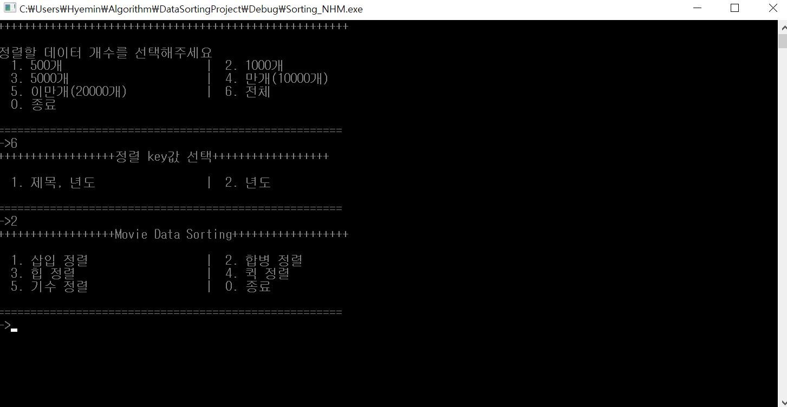
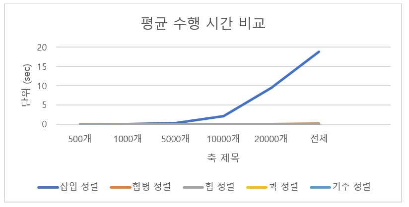
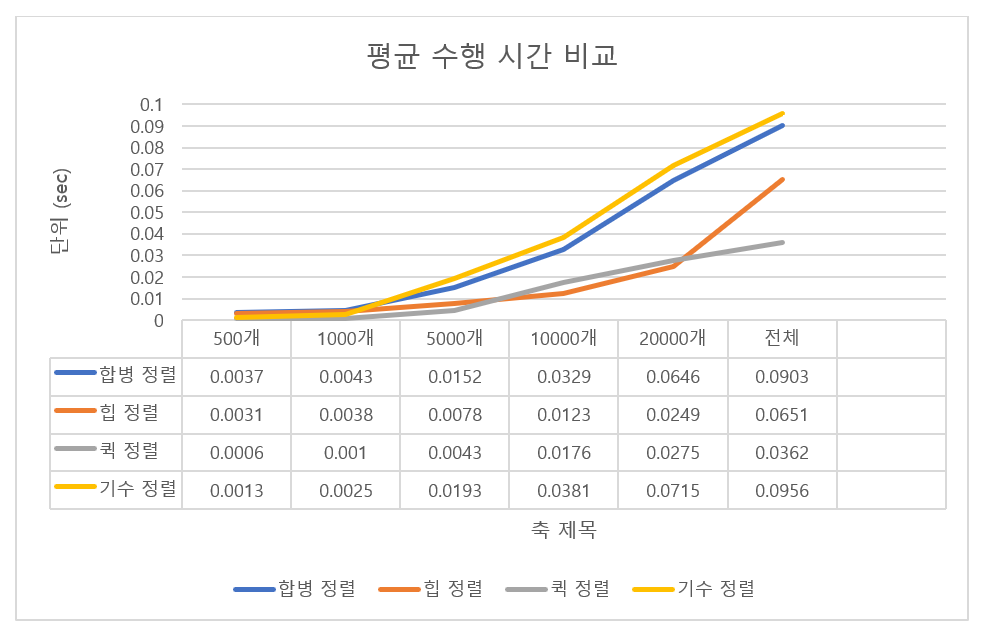

# SortingAlgorithms
##### 2017년 알고리즘 강의 설계 과제
--------------------------
1. 프로젝트 설명
    정렬 알고리즘 실제 수행시간과 이론상의 시간 복잡도를 비교 분석

2. 구현 내용
    'movie.txt' 텍스트 파일 입력 후     
    5가지의 정렬 알고리즘을 수행하고 수행 시간을 측정   
    (삽입 정렬, 합병 정렬, 힙 정렬, 퀵 정렬, 기수 정렬)
    
    >* 동작 방식    
    >    실행 시 몇개의 데이터를 정렬할지 선택하고 키 값을 지정     
    >    정렬의 종류를 선택하면 정렬이 수행     
    >    정렬된 데이터를 출력 후 수행시간이 출력

3. 실행 화면

    

4. 분석 결과

    

    * 데이터가 많아질수록 삽입 정렬과 다른 정렬 간의 편차가 커짐    
    삽입 정렬과 다른 정렬 간의 차이를 위의 차트를 통해 확인하기 어려움
        
    

    * 삽입 정렬을 제외한 나머지 정렬들 사이의 수행 시간을 분석 하기위해 삽입 정렬을 제외한 차트
    
    - 데이터 개수가 많을 때 퀵 정렬이 가장 효율적   
    퀵 정렬의 경우 입력 데이터 개수 변화 시 다른 정렬보다 완만한 상승 폭을 보임

5. 결론
    -	이론상으로 기수 정렬이 가장 빠를 것이라고 예상함
    -	전체 데이터 입력 상황을 기준으로 실제 프로그램 구동 결과    
        퀵 정렬이 가장 빠른 수행 속도를 보임
    -	삽입 정렬은 이론적 예상과 일치하게 가장 느린 수행 시간을 보임
    -	이론적으로 합병 정렬과 힙 정렬이 비슷한 수행 시간을 보일 것으로 예상함
    -	실제 프로그램 구동 결과 입력 데이터의 개수가 많을 시 조금의 차이는 보이지만,    
        전체적으로 비슷한 수행 시간을 갖는 것으로 보임
    -	위의 분석을 통해 데이터가 많을 경우 퀵 정렬을 활용하는 것이 효율적일 것으로 보임
    -	전체적으로 모든 정렬은 입력 데이터의 개수와 수행시간이 비례함
    -	전체 데이터를 입력 받았을 때 기준으로
        
        (느림) >> 삽입 정렬 >> 기수 정렬 >> 합병 정렬 >> 힙 정렬 >> 퀵 정렬 >> (빠름)

        위와 같은 수행 시간 속도 순서를 찾음

